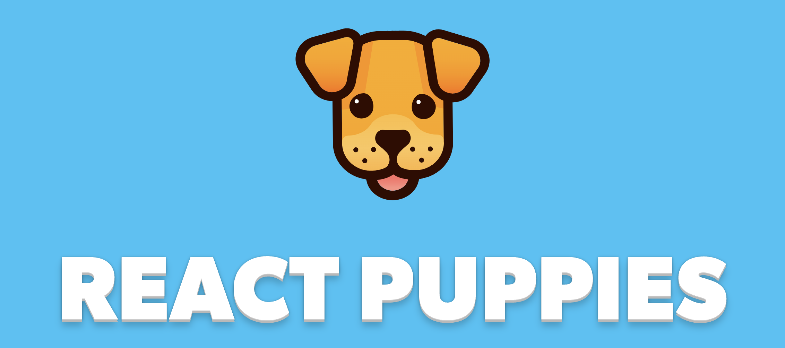

## React Puppies Back-end

React Puppies is a code-along application designed to introduce students to the MERN stack, allowing users to interact with a range of cute canine-related features. Beyond its core functionalities, the application stands out with its integration of interactive Rive animations and the use of customizable SVG assets, bringing a dynamic and visually appealing user experience.

> Please note, this is the back-end server for React Puppies. To run the client app, please visit the [puppies-front](https://github.com/whlong1/puppies-front.git) repository for instructions.

## Getting Started

To run the React Puppies back-end on your local machine, follow these steps:

1. Clone this repository:

    ```bash
    git clone https://github.com/whlong1/puppies-back.git
    ```

2. Navigate to the project directory:

    ```bash
    cd puppies-back
    ```

3. Install the required dependencies:

    ```bash
    npm install
    ```

4. Create a `.env` file in the root directory with the following variables:

    ```
    DATABASE_URL=[MongoDB Connection String]
    ```

5. Start the development server:

    ```bash
    nodemon
    ```